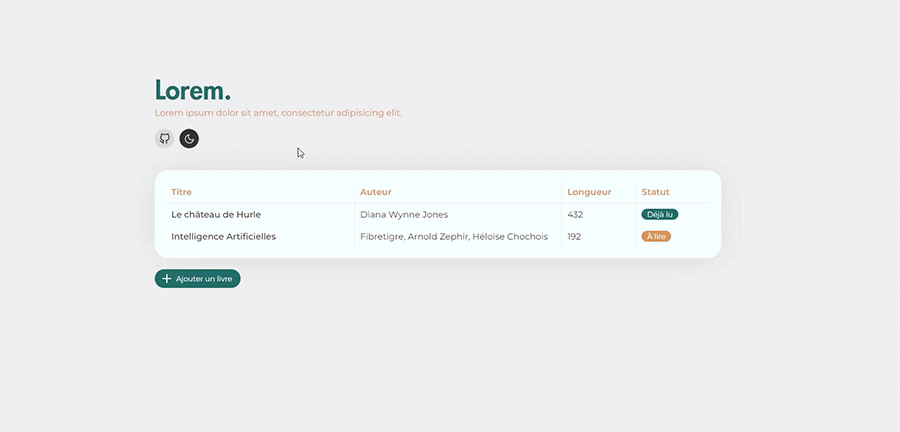

▶️ [Demo](https://web-lux.github.io/librairie/)

## 📄 Description
Une application réalisée dans le cadre de l'[Odin Project](https://www.theodinproject.com/lessons/node-path-javascript-library) afin de pratiquer le javascript vanilla (avec un accent sur les objets et les constructeurs d'objets).

- L'utilisateur peut ajouter un livre à sa bibliothèque.
- Il doit obligatoirement donner un titre, un auteur et un statut au livre à ajouter, mais peut omettre le nombres de pages s'il le souhaite.
- Il peut changer le statut des livres de sa bibliothèque en 1 clic. 
- Il peut également supprimer un livre de sa biblitohèque en 1 clic. 
- Il peut faire le choix d'utiliser l'application en thème clair ou sombre via un toggle. 

## 🔨 Outils utilisés
- HTML
- SCSS
- Javascript
